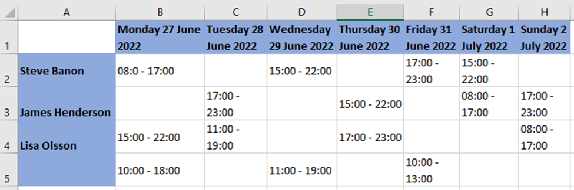
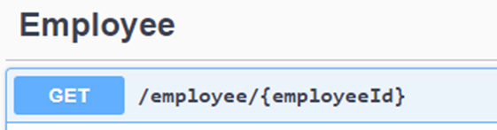
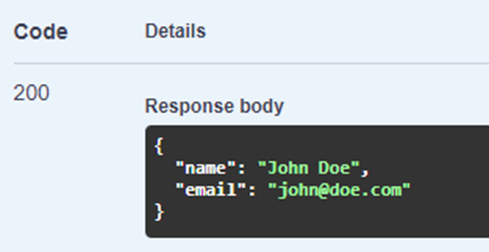

# Code challenge

The goal of this code challenge is for us to get an insight into how you work as a software developer. Besides giving us some insight into your ways of working and thinking it will also be used in next stage interviews.

This challenge is split into four tasks, in order of difficulty. Complete as much as you can; it is not mandatory to finish all the tasks. The code challenge contains the basic structure of a Scheduling API. In the API, you can assign shifts to employees.

To give a visual idea of what it could look like, and explain the concepts, this is a mockup of a UI that this backend should support.



You can see then, for example, that the employee **Steve Banon** is assigned to a Shift on **Monday 27 June 2022** from **08:00 – 17:00**. The same for **James Henderson** on **Thursday 30 June 2022** from **15:00 – 22:00**.

There is also a special case: open shifts. An open shift is a shift that is available, but no employee is assigned to it yet. You can see it in the last row, for example there is an open shift for **Wednesday 29 June 2022** from **11:00 – 19:00**.

## Task 1: Query a shift

Add an endpoint and the necessary services to the solution in the ShiftController that returns a shift based on its id.

**Acceptance criteria:**

-	There is an endpoint which returns a shift.
-	The endpoint needs a Shift Id as input.

## Task 2: Create an open shift

Add an endpoint and the necessary services to create an open shift. An open shift is a Shift **without an employee assigned**.

**Acceptance criteria:**

-	The endpoint will create a shift without employee assigned to it.
-	The endpoint needs a shift model as input.
-	The start time must not be greater than the end time.
-	Start and end time should be in the same day.

## Task 3: Assign a shift to an employee

Add an endpoint and the necessary services to assign a shift to an employee.

**Acceptance criteria:**

-	The endpoint needs the Shift Id and the Employee Id.
-	Both the employee and the shift must exist.
-	The employee must not have overlapping shifts. That means: an employee cannot be assigned to a shift in a time where is already working.
-	You cannot assign the same shift to two or more employees.

## Task 4: Create an API client to fetch the employee information

In <http://20.101.230.231:5000/> we have published an employee API. It has only one endpoint, that returns the information of the employee by Id. You can check the swagger documentation here: <http://20.101.230.231:5000/swagger/index.html>





You need to authenticate the call. Use this key: 

```
8e0ac353-5ef1-4128-9687-fb9eb8647288
```
An example of a call:

```
curl -X 'GET' \
  'http://20.101.230.231:5000/employee/2' \
  -H 'accept: */*' \
  -H 'Authorization: 8e0ac353-5ef1-4128-9687-fb9eb8647288'
```

When retrieving the information of the shifts, we also want to get the information of the employee’s email in the endpoint (task 1).

**Acceptance criteria:**

-	The Get Shift by Id endpoint must also show the email of the employee.
-	We do not want you to save the employee’s email when assigning the shift. We want to retrieve the email from this external API when requesting the information of the shift.

## Additional notes:

- **About SQL:**
    * There is a SQLite database that contains the tables with some shifts and employees, along with a C# query to connect to it. Use that as a base.
    * We also added a SQL script (```dbtables.sql```). It doesn't have any effect on the solution, but is the script we used to create the tables and feed the data.
    * You can interact with the database outside of the project by using the SQLite CLI. You can download the `sqlite-tools` [here](https://www.sqlite.org/download.html). How to use it:
```
./sqlite3 planday-schedule.db
SELECT * FROM Shift;
1|1|2022-06-17 12:00:00.000|2022-06-17 17:00:00.000
2|2|2022-06-17 09:00:00.000|2022-06-17 15:00:00.000
SELECT * FROM Employee;
1|John Doe
2|Jane Doe
```  
- We expect you to spend no more than 4 hours in the assignment. If you want you can spend more, but please consider that as a recommendation for the efforts you need to put in this challenge.
- Make all the design decisions that you consider pertinent.
- We highly value a solution with tests.
- Any idea for performance improvements is welcomed. You don’t need to implement them if you don’t have enough time.
